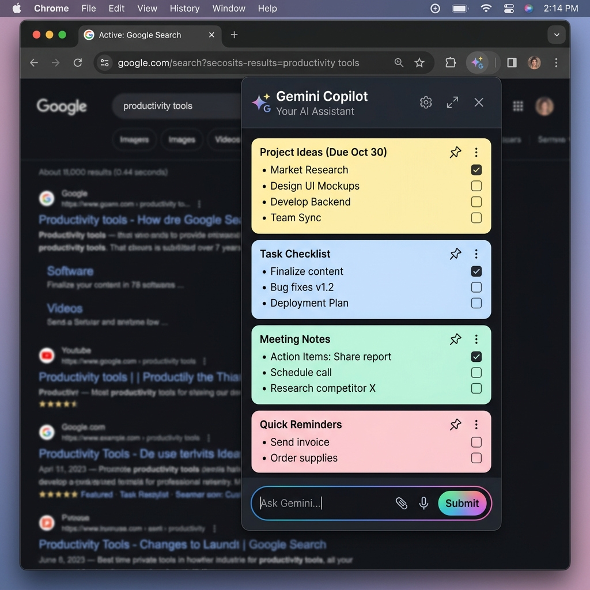

# ✨ Gemini Chrome Copilot

A powerful, context-aware AI assistant packed inside a lightweight Chrome Extension. Gemini Copilot instantly understands the webpage you are looking at and utilizes the **Gemini 2.5 Flash** model securely within your browser to summarize content, draft replies, extract insights, and more.

## 📸 Extension Preview

## 🌟 End-to-End Flow & How It Works
1. **API Key Setup:** Upon the very first launch, the extension will slide open a clean Settings UI. It asks for your Gemini API Key.
2. **Secure Storage:** The key is encrypted and stored locally within Chrome (`chrome.storage.local`).
3. **Execution:** You navigate to any webpage and hit "Summarize Page" (or use a contextual Smart Action).
4. **Context Gathering:** The extension's `content.js` sweeps the current active tab and packages the raw text, sending it to `popup.js`.
5. **Direct AI Routing:** `popup.js` securely calls Google's REST API (`generativelanguage.googleapis.com`) using `gemini-2.5-flash`—**no intermediary backend server required.**
6. **Smart Parsing:** The incoming response markdown is parsed dynamically into interactive, colored "sticky-note" boxes for instant readability. Bold keywords are highlighted.

## 🔥 Key Features
* **Smart UI & Aesthetics:** Results are broken down into beautiful, color-coded pastel sticky notes (Green for Pros, Pink for Risks, Blue for Keys, Yellow for Info) hovering on a dark theme.
* **Intelligent Formatting:** Forces Gemini to extract key terms and organically **bold** them inside the interactive summary notes.
* **Instant Caching:** Built-in Lightning Cache utilizing Chrome Storage! The extension automatically securely caches your last 20 generated summaries. If you revisit a page and hit summarize, it loads *instantly* with 0 API calls or delay.
* **Contextual Actions:** Automatically adapts to the page. It knows if you're looking at a standard article (Summarize), a Gmail thread (Draft Reply), or an Amazon page (Extract Reviews).

## 🔑 How to get your Google API Key
1. Go to [Google AI Studio](https://aistudio.google.com/).
2. Sign in with your Google account.
3. On the left side panel, click **Get API Key**.
4. Click **Create API Key** and generate it for a new project.
5. Copy this key (`AIzaSy...`)—you will paste this directly into the extension when you open it for the first time!

## 🚀 How to Run It (Installation)
1. Download or clone this directory to your computer.
2. Open your Chrome Browser and navigate to `chrome://extensions/`.
3. In the top right corner, toggle **Developer mode** ON.
4. In the top left corner, click **Load unpacked**.
5. Select the main `gemini-chrome-copilot` folder that contains the `manifest.json`.
6. Click the Extensions Puzzle icon in Chrome and **Pin** "✨ Gemini Copilot" to your taskbar!
7. Click the icon, paste your key, and you are ready to go!
